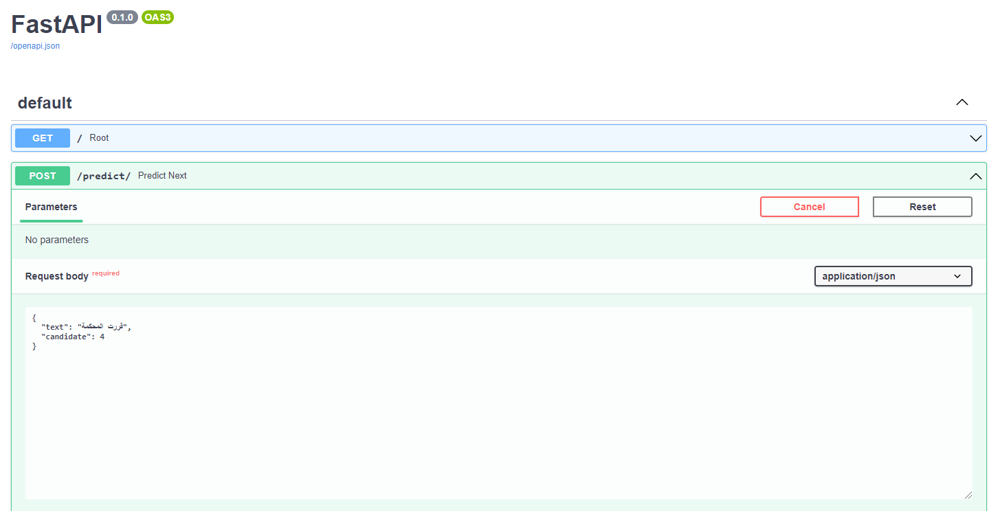

<center align="center">
<h1 align="center"><font size="+4">Arabic Autocomplete System</font></h1>
</center>

<h1 color="green"><b>Abstract</b></h1>
<p>Auto-Complete is a feature that provides relevant suggestions based on input by the user. It works best in domains with a limited number of possible words.
</p>

<h1 color="green"><b>Tried Methods</b></h1>
<ol>
<li>N-grams Language Model</li>
<li>Word Level RNN Language Model</li>
<li>Subword Level RNN Language Model</li>
<li>Character Level RNN Language Model</li>
<li>Transformer Language Model</li>
</ol>

<h1 color="green"><b>Training Dataset</b></h1>
<p>1.5 billion words Arabic Corpus dataset was used for this specific task. In this <a href="https://arxiv.org/ftp/arxiv/papers/1611/1611.04033.pdf">paper</a>, the researcher has chosen ten sources to be used in the corpus. Several news websites were tested before selecting the source that will be used. The fame of the website, and the news source, or the number of readers were not the criterion for selection. There were other criteria and technical reasons for selecting the news resources used in building the corpus.

Out of all these ten sources, only two were chosen to be used due to limited resources. Almasralyoum which was used to train all our models and youm7 which was only used in fine tuning the transformer along with Almasralyoum.
</p>

<h1 color="green"><b>Application</b></h1>
<p>The Transformer was the model used to build an API using a new easy web framework which is FastAPI. In order to try out the application, please follow the following instructions:</p>

1. Install all Python libraries that the notebooks depend on:

```python
pip install -r requirements.txt
```

2. Download the trained model from this link: <a href="https://drive.google.com/file/d/1hFHRaV7bmzKQrn92ew4-pQBsAcIg3HjG/view?usp=sharing">Finetuned-Transformer</a>

3. Clone the Arabert repo:
```python
git clone https://github.com/aub-mind/arabert.git
```

4. Run the server:

```python
uvicorn transformer_fastapi:app --reload
```

5. Navigate to your local host `http://localhost:8000/docs`

6. Assign the prefix text and the number of words to be predicted


<h1 color="green"><b>Demo</b></h1>


